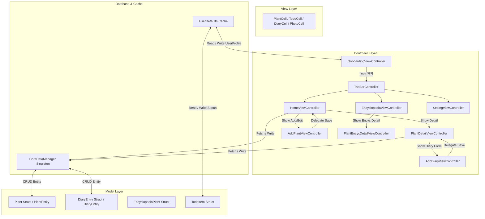
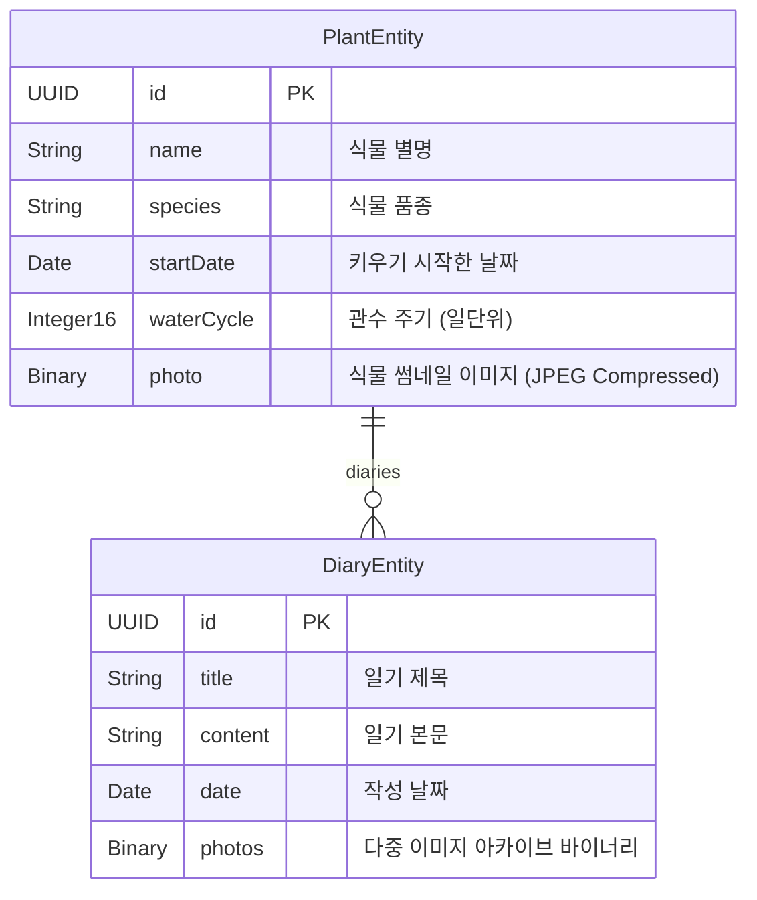

# 🌿 Planty (플랜티) - 반려식물 케어 & 성장 일지 iOS 애플리케이션

> **iOS 프로그래밍 기말 미니 프로젝트**  
> **개발 기간**: 2026.05 ~ 2026.06  
> **개발자**: 최은 (choeun)

---

## 📌 1. 프로젝트 개요 (Project Overview)
**Planty(플랜티)**는 초보 및 숙련된 반려식물 관리자(식물 집사)를 위한 **반려식물 일정 관리 및 성장 일지 기록 iOS 애플리케이션**입니다.  
사용자는 자신의 정원에 식물을 등록하여 관리하고, 식물별 고유 관수 주기에 맞춰 자동으로 생성되는 '오늘의 할 일(물주기)' 일정을 체크할 수 있습니다. 또한, 사진이 포함된 성장 기록 일지(Diary)를 날짜순으로 모아보고, 다양한 식물 정보가 수록된 로컬 도감(Encyclopedia)을 활용하여 반려식물에 최적화된 생육 환경을 탐색할 수 있습니다.

---

## 🛠 2. 기술 스택 (Tech Stack)
* **Language**: Swift 5.0+
* **Framework**: UIKit (iOS 15.0+)
* **UI/UX Pattern**: Storyboard, Auto Layout, Custom Cells, Dynamic Height Constraints
* **Database & Persistence**: Core Data (Local DB Engine), UserDefaults
* **Multimedia Interface**: PhotosUI (`PHPickerViewController`), Photos (`UIImagePickerController`)
* **Graphics**: Core Graphics (`CAShapeLayer`, `UIBezierPath`)
* **Threading**: Grand Central Dispatch (GCD - `DispatchGroup`, `DispatchQueue.main`)

---

## 📐 3. 시스템 아키텍처 (System Architecture)
Planty는 엄격한 **MVC (Model-View-Controller)** 디자인 패턴을 기반으로 코드를 분리하여 설계되었습니다. 데이터의 변경이 발생할 시 Delegate 및 Singleton Manager를 거쳐 View를 업데이트하는 구조입니다.



### 🛰 주요 네비게이션 및 흐름 (Navigation Flow)
1. **온보딩 단계 (`OnboardingViewController`)**: 
   - 앱 최초 실행 시 `UserDefaults`에 `userName` 키의 부재 여부로 진입을 판단합니다.
   - 사용자 닉네임을 입력받아 저장 후, 메인 윈도우의 `rootViewController`를 `MainTabBarController`로 애니메이션 전환하여 뒤로가기 흐름을 격리합니다.
2. **홈 화면 (`HomeViewController`)**:
   - 메인 화면으로, 등록된 반려식물 목록과 당일 관수 일정(`Todo`)을 한눈에 확인할 수 있습니다.
   - 스크롤 영역 내에서 높이가 동적으로 변경되는 이중 테이블 뷰 구조로 배치되어 있습니다.
3. **상세 화면 (`PlantDetailViewController`)**:
   - 특정 반려식물의 생육 일차(D+Day), 관수 정보, 개별 성장 일지 리스트가 연대순(Descending Date)으로 정렬되어 노출됩니다.
4. **식물 도감 (`EncyclopediaViewController`)**:
   - 총 20종의 꼼꼼하게 빌트인된 로컬 식물 딕셔너리 정보가 2열 그리드(`UICollectionViewFlowLayout`)로 표현됩니다.
   - `UISearchController`와 위임된 `UISearchBarDelegate` 프로토콜을 사용해 한글/학명 다중 매칭 검색 기능을 제공합니다.

---

## 💾 4. 데이터베이스 & 데이터 모델 아키텍처 (Database Design)

### 📊 Core Data Entity Schema & Relationship
로컬 영속성 저장을 위해 Core Data 프레임워크를 사용합니다. DB 스키마는 **1:N(일대다) 관계형 모델**을 구성하고 있습니다.



### 💾 싱글톤 매니저 패턴 (`CoreDataManager.swift`)
전역적인 CRUD 인터페이스를 단일화하기 위해 `CoreDataManager` 싱글톤 클래스를 제공합니다.
* **Context Isolation**: Main Thread에서 안전하게 동기화되는 `viewContext`를 기본 컨텍스트로 활용합니다.
* **Dirty Checking**: 변경사항이 발생한 경우에만 안전하게 커밋될 수 있도록 `saveContext()`에 `guard context.hasChanges` 방어 코드를 구현하여 불필요한 IO 비용을 절약합니다.

### 🖼 바이너리 다중 이미지 아카이빙 기술
Core Data의 기본 속성은 복수의 이미지를 하나의 Attribute에 네이티브하게 매핑할 수 없으므로, **`NSKeyedArchiver`와 `NSKeyedUnarchiver`**를 이용한 직렬화(Serialization)를 도입했습니다.
* **직렬화 (Serialization)**:
  `[UIImage]` 타입의 다중 이미지를 순회하며 `jpegData(compressionQuality: 0.8)`를 통해 바이너리 `Data` 배열(`[Data]`)로 변환합니다. 이후 `NSKeyedArchiver.archivedData(withRootObject:requiringSecureCoding:)`를 활용해 단일 `Data` 구조로 압축 후 `DiaryEntity.photos`에 기록합니다.
* **역직렬화 (Deserialization)**:
  DB 로드 시 `NSKeyedUnarchiver.unarchivedObject(ofClasses:from:)` 메서드에 `[NSArray.self, NSData.self]` 클래스를 전달함으로써 안전하게 바이너리 배열로 형변환(Type-Casting)하고 이를 `UIImage` 객체로 매핑해 UI에 복원합니다.

### 🔑 UserDefaults 기반 임시 저장 & 캐싱 전략
* **사용자 프로필**: `userName` 문자열 데이터를 디스크 캐싱하여 앱 최초 진입 로직 분기 및 다이나믹 라벨링에 사용합니다.
* **일일 관수 체크리스트 실시간 기록**:
  식물 물주기 할 일(`TodoItem`)의 완료 상태는 매일 초기화되어야 합니다. 이를 처리하기 위해 식물의 고유 식별자(`plantId`)와 오늘 날짜를 결합한 **동적 하이브리드 키**를 생성하여 `UserDefaults`에 매핑합니다.
  ```swift
  // 복합 키 생성 알고리즘
  private var todayKey: String {
      let formatter = DateFormatter()
      formatter.dateFormat = "yyyy-MM-dd"
      return formatter.string(from: Date())
  }
  
  var isCompleted: Bool {
      get {
          guard let plantId = plantId else { return false }
          let key = "\(plantId.uuidString)_\(todayKey)"
          return UserDefaults.standard.bool(forKey: key)
      }
      set {
          guard let plantId = plantId else { return }
          let key = "\(plantId.uuidString)_\(todayKey)"
          UserDefaults.standard.set(newValue, forKey: key)
      }
  }
  ```

---

## ⚙️ 5. 핵심 기술 및 알고리즘 구현 (Core Core Features & Implementation)

### ⏱ ① 관수 주기 스케줄러 알고리즘 (Watering Engine)
오늘 반려식물에게 물을 주어야 하는 날인지를 판단하는 연산 알고리즘입니다. 사용자가 직접 설정한 기준일(`startDate`)부터 오늘까지 경과된 순수 날짜 수(D-Day)를 구한 뒤, 식물 고유의 관수 주기(`waterCycle`)와 나머지 연산(`modulo`)을 진행하여 스케줄을 산출합니다.

```swift
private func loadTodoItems() {
    let calendar = Calendar.current
    let today = calendar.startOfDay(for: Date())
        
    todoItems = plants.compactMap { plant in
        let start = calendar.startOfDay(for: plant.startDate)
        let daysPassed = calendar.dateComponents([.day], from: start, to: today).day ?? 0
            
        // 시작일이 미래 날짜가 아니고, 유효 관수 주기 내에서 오늘 정수로 나누어떨어지는지 확인
        guard daysPassed >= 0,
              plant.waterCycle > 0,
              daysPassed % plant.waterCycle == 0 else { return nil }
            
        return TodoItem(title: "\(plant.name) 물주기", plantId: plant.id)
    }
    // UI TableView 갱신 및 리사이징...
}
```

### 📐 ② ScrollView 내부 Nested TableView의 이중 스크롤 충돌 해결 기법
`HomeViewController`는 최상위 `UIScrollView` 내에 오늘의 할 일 테이블 뷰(`todoTableView`)와 정원 리스트 테이블 뷰(`plantTableView`)가 수직으로 내포되어 있습니다. 이는 스크롤 제스처 충돌(Scroll Collision)을 유발해 사용자 경험을 심각하게 저하시킵니다.  
이를 극복하기 위해 테이블 뷰 고유의 스크롤 기능을 중지하고, 데이터 갱신 시점에 **셀의 실제 높이에 맞춰 Auto Layout Constraint의 Constant를 런타임에 동적으로 재계산**하는 기법을 구현했습니다.

* **구현 방식**:
  - 두 테이블 뷰의 `isScrollEnabled` 속성을 `false`로 격리.
  - Core Data에서 데이터를 새로 로드할 때마다 셀 개수를 파악하여 Constraint 값을 강제 업데이트.
  ```swift
  // 할 일 목록 유동적 높이 설정
  todoTableHeightConstraint.constant = todoItems.isEmpty ? 50 : CGFloat(todoItems.count) * 50
  
  // 정원 목록 유동적 높이 설정 (셀 높이인 106pt를 데이터 소스 개수만큼 수증적으로 결합)
  plantTableHeightConstraint.constant = CGFloat(plants.count) * 106
  
  // 변경 사항 즉시 드로잉 엔진에 반영
  self.view.layoutIfNeeded()
  ```

### 🎨 ③ CAShapeLayer & UIBezierPath 기반 점선 드로잉 인터페이스
사용자에게 반려식물 사진 등록 가이드를 미려하게 제공하고자, 런타임에 UIView 레이아웃이 확정되는 즉시 Core Graphics 파이프라인의 **`CAShapeLayer`와 `UIBezierPath`**를 사용해 맞춤형 대시 보더(점선 테두리)를 렌더링했습니다.
```swift
private func setupDashBorder() {
    let dashBorder = CAShapeLayer()
    dashBorder.strokeColor = UIColor.lightGray.cgColor
    dashBorder.lineDashPattern = [6, 3] // 6pt 그리고, 3pt 건너뛰는 패턴 정의
    dashBorder.frame = photoView.bounds
    dashBorder.fillColor = nil
    dashBorder.path = UIBezierPath(
        roundedRect: photoView.bounds,
        cornerRadius: 8
    ).cgPath
    photoView.layer.addSublayer(dashBorder)
}
```
* **오프스크린 방지**: 레이아웃이 완성되기 전에 사각형 패스를 그리면 점선 프레임이 어긋나는 이슈가 있습니다. 이를 제어하기 위해 뷰 컨트롤러 라이프사이클 중 프레임 버퍼가 정렬 완료되는 오버라이드 메서드 `viewDidLayoutSubviews` 시점에서 점선 border를 계산해 주입하고, `dashBorderAdded` 플래그로 1회만 중복 없이 드로잉되도록 동기화했습니다.

### 🖼 ④ PHPickerViewController & DispatchGroup 비동기 이미지 파싱
상세 페이지의 다이어리 생성 모듈(`AddDiaryViewController`)에서는 여러 장의 생생한 사진을 동시 첨부할 수 있습니다. 기존의 레거시 `UIImagePickerController`는 단일 선택만 가능하므로, 최신 **`PhotosUI`의 `PHPickerViewController`**를 활용했습니다.  
또한, 사진첩 내부 에셋 파일들로부터 메인 메모리로 데이터를 디코딩하는 비동기 처리가 지연될 시, 목록 UI 로드가 어긋나는 레이스 컨디션을 방지하기 위해 **`DispatchGroup`**을 배치하여 로직 안정성을 확보했습니다.

```swift
func picker(_ picker: PHPickerViewController, didFinishPicking results: [PHPickerResult]) {
    picker.dismiss(animated: true)
    guard !results.isEmpty else { return }
    
    let group = DispatchGroup()
    
    for result in results {
        let itemProvider = result.itemProvider
        
        if itemProvider.canLoadObject(ofClass: UIImage.self) {
            group.enter() // 대기열 진입
            itemProvider.loadObject(ofClass: UIImage.self) { [weak self] (image, error) in
                if let image = image as? UIImage {
                    DispatchQueue.main.async {
                        self?.selectedImages.append(image)
                    }
                }
                group.leave() // 비동기 로드 완료 후 이탈
            }
        }
    }
    
    // 등록된 비동기 작업이 모두 해제(Notify)된 순간에 메인 스레드에서 UI를 동기화
    group.notify(queue: .main) { [weak self] in
        self?.photoCollectionView.reloadData()
    }
}
```

---

## 📂 6. 디렉토리 구조 (Directory Structure)

```text
Planty/
├── Planty/
│   ├── AppDelegate.swift             # Application Entry & Life Cycle
│   ├── SceneDelegate.swift           # Scene Life Cycle & Window Root Config
│   ├── Info.plist                    # App Configuration Properties
│   ├── Planty.xcdatamodeld           # Core Data Schema Model Configuration
│   │
│   ├── Models/                       # Data Model Structs
│   │   ├── Plant.swift               # 식물 인스턴스 (D-Day 및 생성 로직)
│   │   ├── DiaryEntry.swift          # 개별 성장 기록 다이어리
│   │   ├── EncyclopediaPlant.swift   # 식물 도감 고정 리포지토리 (20종)
│   │   └── TodoItem.swift            # 당일 관수 체크 일정 데이터 
│   │
│   ├── ViewControllers/              # UI Controllers (MVC - C)
│   │   ├── TabBarController.swift    # 하단 탭 관리 뷰 컨트롤러
│   │   ├── OnboardingViewController.swift # 앱 최초 진입 및 닉네임 캐싱
│   │   ├── HomeViewController.swift  # 당일 일정, 정원 식물 동적 바인딩
│   │   ├── AddPlantViewController.swift   # DatePicker & PickerView 연동 식물 등록
│   │   ├── PlantDetailViewController.swift# 상세 관리 프로필 & 일지 목록 스크롤
│   │   ├── AddDiaryViewController.swift  # PHPicker 멀티 로드 식물 기록 작성
│   │   ├── EncyclopediaViewController.swift # 도감 다차원 정렬 & 실시간 서치
│   │   ├── PlantEncycDetailViewController.swift # 도감 상세 관리 생육 정보 
│   │   └── SettingViewController.swift   # 설정 (이름 변경, 앱 초기화)
│   │
│   ├── Cells/                        # Custom Table/Collection View Cells (MVC - V)
│   │   ├── PlantCell.swift           # 정원 메인 식물 셀
│   │   ├── TodoCell.swift            # 오늘의 관수 일정 셀
│   │   ├── DiaryCell.swift           # 성장 일지 요약 셀
│   │   ├── PhotoCell.swift           # 첨부 사진 미리보기 & 개별 삭제 버튼 셀
│   │   └── EncyclopediaCell.swift    # 도감 격자 그리드 카드 셀
│   │
│   └── CoreDateManager.swift         # Core Data Persistent Controller Singleton
│
├── Planty.xcodeproj                  # Xcode Project File
└── README.md                         # Project Documentation
```

---

## 💻 7. 개발 환경 및 실행 방법 (Requirements & Installation)

### 📋 요구 사항 (System Requirements)
* **OS**: macOS Sonoma 14.0 이상 권장
* **IDE**: Xcode 15.0 이상
* **Language SDK**: Swift 5.9 / Swift 5.10 이상
* **Dependency Manager**: 없음 (External Library Dependency 없이 Native Framework 만으로 가볍고 고성능으로 동작하도록 완전 격리 빌드)

### 🚀 빌드 및 실행 가이드 (Build & Run)
1. 본 레포지토리를 개발 장비로 클론합니다.
   ```bash
   git clone https://github.com/ch0412/Planty.git
   ```
2. `Planty.xcodeproj` 파일을 Xcode를 통해 실행합니다.
   ```bash
   open Planty/Planty.xcodeproj
   ```
3. Target 디바이스를 iOS 15.0 이상 환경의 시뮬레이터(예: iPhone 15) 또는 물리 기기로 지정합니다.
   * *물리 기기 빌드 시, Xcode 프로젝트 설정의 'Signing & Capabilities' 탭에서 개발자 계정 Team을 설정해야 정상적으로 인증 서명이 완료됩니다.*
4. 키보드 단축키 `Cmd + R` 키를 누르거나 Xcode 좌측 상단의 **Run** ▶ 버튼을 눌러 프로젝트를 빌드하고 시뮬레이터에서 실행합니다.
